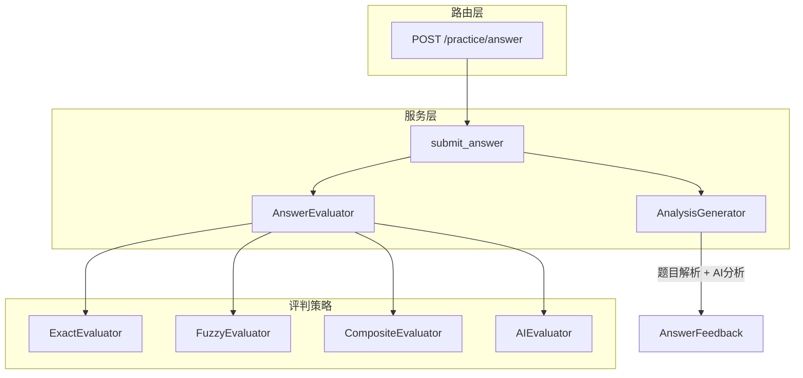

# 答题功能重构方案

## 背景分析

当前 `answer.py` 只做简单的字符串匹配，无法适配多种题型。路由文件中已有 `evaluate_*` 函数但未被使用。需要统一评判逻辑，并返回结构化数据供前端渲染。

## 核心数据结构

### 题型交互类型 (14种)

- single_choice, multi_choice, image_choice
- text_input, handwriting, voice_input
- drag_drop, connect_line, sort_order
- true_false, correct_wrong
- follow_read, free_speak
- fill_blank, multi_step

### 答案类型 (5种)

- exact: 精确匹配
- fuzzy: 模糊匹配
- rubric: 评分标准
- ai: AI 评分
- composite: 复合题

## 架构设计



## 文件变更

### 1. 新增评判器模块

**文件**: `shared/practice/evaluator.py`

```python
class AnswerEvaluator:
    """答案评判器 - 根据 answer.type 选择策略"""
    
    @staticmethod
    def evaluate(question: Question, user_answer: Any) -> EvaluateResult:
        answer_type = question.answer.get("type", "exact")
        evaluator = EVALUATOR_MAP.get(answer_type, ExactEvaluator)
        return evaluator.evaluate(question, user_answer)

class EvaluateResult(BaseModel):
    is_correct: bool
    score: float
    full_score: float
    correct_answer: dict  # 结构化正确答案
```

### 2. 更新 Schema 定义

**文件**: `shared/practice/schema.py`

新增结构化反馈 Schema：

```python
class CorrectAnswerSchema(BaseModel):
    """结构化正确答案"""
    type: str  # 与 interaction_type 对应
    value: Optional[Any] = None      # 单值答案
    values: Optional[list] = None    # 多值答案
    options: Optional[list] = None   # 选项详情（含文本）
    sub_answers: Optional[list] = None  # 复合题子答案

class AnswerFeedbackSchema(BaseModel):
    """答题反馈（错题时返回）"""
    correct_answer: CorrectAnswerSchema  # 结构化正确答案
    explanation: Optional[str] = None    # 题目自带解析
    analysis: Optional[str] = None       # AI 针对性分析
```

### 3. 重构答题服务

**文件**: `shared/practice/answer.py`

主要改动：

- 变量重命名：`session` -> `practice`
- 修复 docstring 参数顺序
- 使用 `AnswerEvaluator` 替代简单匹配
- 生成结构化正确答案
- 结合题目解析和 AI 分析
```python
async def submit_answer(db: AsyncSession, student_id: str, params: SubmitAnswerSchema):
    # ... 验证逻辑 ...
    
    # 使用评判器评判答案
    result = AnswerEvaluator.evaluate(question, params.answer)
    
    # 生成反馈
    feedback = None
    if not result.is_correct:
        feedback = await generate_feedback(question, params.answer, result)
    
    # 更新答题记录
    answer_record.status = 1 if result.is_correct else 2
    answer_record.correct_answer = json.dumps(result.correct_answer)
    answer_record.analysis = feedback.model_dump_json() if feedback else None
    # ...
```


### 4. 更新返回 Schema

**文件**: `shared/core/schema/practice.py`

更新 `PracticeAnswerSchema`：

```python
class PracticeAnswerSchema(BaseModel):
    # ... 现有字段 ...
    
    # 更新错题字段类型
    correct_answer: Optional[dict] = None  # 改为 dict，存储结构化数据
    analysis: Optional[dict] = None        # 改为 dict，包含 explanation + analysis
```

## 前端返回数据示例

### 单选题错误

```json
{
  "status": 2,
  "correct_answer": {
    "type": "single_choice",
    "value": "B",
    "options": [{"id": "B", "text": "北京"}]
  },
  "analysis": {
    "explanation": "中国的首都是北京，位于华北平原...",
    "analysis": "你选择了上海，这是一个常见的混淆。上海是经济中心，而北京是政治中心..."
  }
}
```

### 复合题部分错误

```json
{
  "status": 2,
  "correct_answer": {
    "type": "composite",
    "sub_answers": [
      {"sub_id": "1", "is_correct": true, "value": "A"},
      {"sub_id": "2", "is_correct": false, "value": "C", "text": "正确选项内容"}
    ]
  },
  "analysis": {
    "explanation": "本题考查...",
    "analysis": "第2小题错误，你选择了B，正确答案是C..."
  }
}
```

## 兼容性处理

- `correct_answer` 字段从 `str` 改为 `dict`，需要处理历史数据
- 前端需要判断 `correct_answer` 类型进行兼容渲染
- 数据库字段保持 `Text` 类型，存储 JSON 字符串

## 评判策略详情

| answer_type | 评判方式 | 说明 |

|-------------|----------|------|

| exact | 字符串精确匹配 | 选择题、判断题 |

| fuzzy | 大小写忽略 + accept_answers | 填空题、简答题 |

| rubric | 基于评分标准 | 需要预定义评分规则 |

| ai | 调用 AI 评判 | 口语题、开放题 |

| composite | 递归评判子题 | 复合题 |