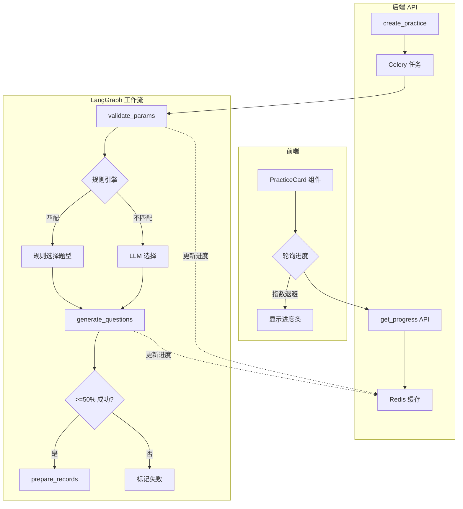

# 练习生成代码全面重构方案

## 重构目标

1. **前端**: 消除组件重复，统一状态管理，优化轮询机制
2. **后端**: 提升代码质量，移除冗余逻辑
3. **体验**: 实时进度反馈，缩短感知等待时间
4. **健壮性**: 部分成功处理，断点续传

---

## 前端问题分析

### 1. 组件高度重复

`PracticeAbility` 和 `PracticeUnit` 存在大量重复代码：

- `WaitCard.tsx` vs `WaitCard.tsx` - ~80% 重复
- `GeneratingCard.tsx` vs `GeneratingCard.tsx` - ~90% 重复
- `PracticingCard.tsx` vs `PracticingCard.tsx` - ~85% 重复
- `CompleteCard.tsx` vs `CompleteCard.tsx` - ~75% 重复
- `useAbilityPractice.ts` vs `useUnitPractice.ts` - ~90% 重复
- `PracticeCard.tsx` vs `UnitPracticeCard.tsx` - ~95% 重复

### 2. 轮询机制缺陷

```typescript
// useAbilityPractice.ts 第 23-27 行
onSuccess: (res) => {
  if (res?.generate_status === PracticeGenerateStatus.GENERATING) {
    setTimeout(() => refresh(), 1000);  // 固定 1 秒轮询
  }
}
```

**问题**:

- 固定 1 秒间隔，无指数退避
- 无最大重试次数限制
- 后端失败时会无限轮询
- 无进度信息展示

### 3. 状态判断散乱

```typescript
// PracticeCard.tsx 多处冗余的 null 检查
if (!textbook) return null;  // 出现 4 次
```

### 4. 导航路径不一致

```typescript
// 能力练习
navigate(`/practice/${practice?.id}`)
// 单元练习  
navigate(`/practice/session/${practice?.id}`)
```

---

## 后端问题分析

详见之前的分析，主要问题：

- [generate.py](apps/server/shared/practice/generate.py) 与 [service.py](apps/server/shared/generation/practice/service.py) 存在重复的验证逻辑
- [graph.py](apps/server/shared/generation/practice/graph.py) 的 `handle_error_node` 未生效
- 类型标注不规范
- Pydantic 模型定义在函数内部

---

## 架构概览



---

## 阶段1: 前端重构

### 1.1 抽取通用 PracticeCard 组件

**新目录**: `components/biz/PracticeCard/`

```
components/biz/PracticeCard/
├── index.tsx           # 主组件，统一状态判断
├── WaitCard.tsx        # 等待状态
├── GeneratingCard.tsx  # 生成中状态（支持进度显示）
├── PracticingCard.tsx  # 练习中状态
├── CompleteCard.tsx    # 已完成状态
├── usePractice.ts      # 通用 Hook
└── types.ts            # 类型定义
```

**统一接口设计**:

```typescript
// types.ts
interface PracticeCardProps {
  type: "ability" | "unit";
  abilityCode?: string;  // 能力练习
  unit?: Unit;           // 单元练习
  textbook?: Textbook;
}

// usePractice.ts - 统一 Hook
function usePractice(props: {
  type: "ability" | "unit";
  abilityCode?: string;
  unitId?: number;
}) {
  const queryFn = type === "ability" 
    ? () => studentApi.getAbilityPracticeByCode(abilityCode!)
    : () => studentApi.getUnitPracticeById(unitId!);
  // ...
}
```

### 1.2 优化轮询机制

```typescript
const POLL_CONFIG = {
  initialInterval: 1000,
  maxInterval: 5000,
  maxRetries: 60,
  backoffMultiplier: 1.2,
};
```

### 1.3 统一导航路径

```typescript
navigate(`/practice/session/${practice?.id}`)
```

---

## 阶段2: 后端代码清理

### 2.1 移除重复逻辑

**文件**: [generate.py](apps/server/shared/practice/generate.py)

移除第 99-131 行的 subject/grade 获取逻辑，由 workflow 统一处理。

### 2.2 清理无效节点

**文件**: [graph.py](apps/server/shared/generation/practice/graph.py)

- 移除 `handle_error_node`
- 移除冗余日志辅助函数
- 修复类型标注

### 2.3 优化 service.py

**文件**: [service.py](apps/server/shared/generation/practice/service.py)

- 将 Pydantic 模型移至模块顶层
- 使用列表推导式

---

## 阶段3: 进度 API

### 3.1 后端 - Redis 进度服务

**新文件**: `shared/services/progress.py`

```python
class ProgressService:
    async def update_progress(self, session_id: str, progress: int, step: str) -> None: ...
    async def get_progress(self, session_id: str) -> dict | None: ...
```

### 3.2 后端 - 进度查询接口

```python
@practice_router.get("/{session_id}/progress")
async def get_practice_progress(session_id: str): ...
```

### 3.3 前端 - GeneratingCard 进度展示

```typescript
// GeneratingCard.tsx
const { data: progress } = useRequest(
  () => studentApi.getPracticeProgress(sessionId),
  { pollingInterval: 2000 }
);

return (
  <div className="progress-bar">
    <div style={{ width: `${progress?.progress || 0}%` }} />
    <span>{progress?.step || "准备中..."}</span>
  </div>
);
```

---

## 阶段4: 部分成功处理

修改 `generate_questions_node`:

- 成功率 >= 50% 视为部分成功
- 记录失败的题型供后续分析

---

## 阶段5: 规则化题型选择

**新文件**: `shared/practice/question_type_rules.py`

- 规则优先，LLM 兜底
- 减少 ~3-5 秒延迟

---

## 阶段6: LangGraph Checkpointing

- 使用 Redis Checkpointer
- 支持从失败节点恢复

---

## 涉及文件汇总

### 前端 (student-web)

| 操作 | 文件 |

|------|------|

| 新增 | `components/biz/PracticeCard/*` |

| 修改 | `pages/PracticeAbility/index.tsx` |

| 修改 | `pages/PracticeUnit/index.tsx` |

| 删除 | `pages/PracticeAbility/components/*` (迁移后) |

| 删除 | `pages/PracticeUnit/components/*` (迁移后) |

| 修改 | `lib/api.ts` (新增 progress API) |

### 后端 (server)

| 操作 | 文件 |

|------|------|

| 修改 | `shared/practice/generate.py` |

| 修改 | `shared/generation/practice/graph.py` |

| 修改 | `shared/generation/practice/service.py` |

| 新增 | `shared/services/progress.py` |

| 新增 | `shared/practice/question_type_rules.py` |

| 修改 | `student/practice/route.py` |

---

## 新增依赖

```bash
# 后端
uv add redis
```

---

## 测试要点

1. 前端通用组件在能力练习和单元练习中正常工作
2. 轮询机制在超时后正确停止
3. 进度 API 返回正确的进度信息
4. 部分成功时练习仍可正常使用
5. 规则匹配时不调用 LLM