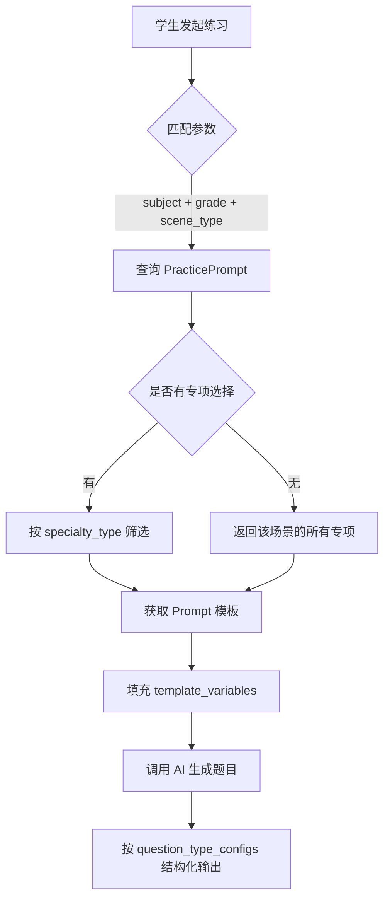
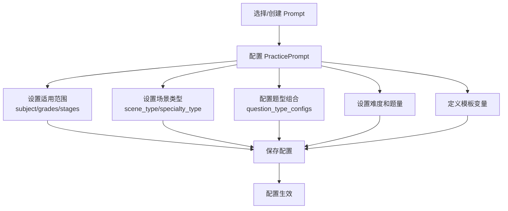

# 练习提示词数据结构设计

基于提示词库文档和现有数据结构，设计练习提示词的数据模型。

## 设计目标

1. **按场景+专项拆分**：每个提示词记录对应一个具体的场景和专项组合
2. **元数据存储在 JSON 字段**：利用 Prompt 表的 JSON 字段存储结构化元数据
3. **运行时参数传入**：提示词模板变量在调用 AI 时动态替换
4. **关联题型组合**：存储结构化的题型配置，可关联 QuestionType
5. **双端支持**：同时支持管理后台配置和学生端自动匹配
6. **统一场景模型**：Practice 表存储场景类型，PracticePrompt 表存储专项配置

---

## 数据模型设计

### 1. 优化 Practice 表

根据文档分析，现有 `Practice` 表结构较简单，缺少以下关键配置：

| 缺失配置 | 来源文档     | 说明                               |
| -------- | ------------ | ---------------------------------- |
| 场景类型 | 提示词库     | 日常训练/单元测试/综合评估三种场景 |
| 题量配置 | 提示词库     | 3-5 题/5-15 题/15-20 题            |
| 难度分布 | 提示词库     | 易中难比例分布                     |
| 学段年级 | 题型优化方案 | 支持 K12 全学段                    |
| 能力维度 | 题型优化方案 | 识记/理解/应用能力层次             |
| 反馈配置 | 题型优化方案 | 游戏化设计、即时反馈               |

**重构后的 Practice 表**：

```python
class Practice(BaseModel):
    """练习表（重构后）"""

    __tablename__ = "ah_practice"

    id: Mapped[int] = mapped_column(primary_key=True, autoincrement=True)

    # 基础信息（保留）
    name: Mapped[str] = mapped_column(String(100), comment="练习名称")
    slug: Mapped[str] = mapped_column(String(100), unique=True, index=True, comment="练习标识")
    type: Mapped[str] = mapped_column(String(20), index=True, comment="类型：system/custom")
    icon: Mapped[str] = mapped_column(String(255), nullable=True, comment="图标URL")
    description: Mapped[str] = mapped_column(Text, nullable=True, comment="描述")

    # 场景类型（新增）
    scene_type: Mapped[str] = mapped_column(String(50), index=True, comment="场景类型")
    # daily_training: 日常训练 - 单一知识点强化，3-5题/组
    # unit_test: 单元测试 - 单元知识点全面检测，10-15题
    # comprehensive_assessment: 综合评估 - 跨单元知识整合，15-20题

    # 适用范围（新增）
    subject: Mapped[str] = mapped_column(String(50), nullable=True, index=True, comment="科目")
    stages: Mapped[list] = mapped_column(JSON, default=list, comment="适用学段列表")
    grades: Mapped[list] = mapped_column(JSON, default=list, comment="适用年级列表")

    # 题量配置（新增）
    question_count_config: Mapped[dict] = mapped_column(JSON, nullable=True, comment="题量配置")
    # {
    #     "total": 5,              # 总题数
    #     "per_group": 5,          # 每组题数（日常训练）
    #     "max_groups": 3,         # 最大组数
    #     "time_limit_minutes": 15 # 建议时长
    # }

    # 难度配置（新增）
    difficulty_config: Mapped[dict] = mapped_column(JSON, nullable=True, comment="难度配置")
    # {
    #     "level": "basic",        # 难度层次
    #     "target_accuracy": 0.8,  # 目标正确率
    #     "distribution": {        # 难度分布（单元测试/综合评估）
    #         "easy": 6,
    #         "medium": 3,
    #         "hard": 1
    #     }
    # }

    # 能力维度（新增）
    ability_config: Mapped[dict] = mapped_column(JSON, nullable=True, comment="能力维度配置")
    # {
    #     "cognitive_levels": ["remember", "understand", "apply"],  # 认知层次
    #     "distribution": {        # 能力层次分布（综合评估）
    #         "remember": 5,       # 识记
    #         "understand": 8,     # 理解
    #         "apply": 7           # 应用
    #     }
    # }

    # 反馈配置（新增）- 游戏化设计
    feedback_config: Mapped[dict] = mapped_column(JSON, nullable=True, comment="反馈配置")
    # {
    #     "instant_feedback": true,     # 即时反馈
    #     "show_explanation": true,     # 显示解析
    #     "gamification": {
    #         "enable_points": true,    # 启用积分
    #         "enable_badges": true,    # 启用徽章
    #         "enable_progress": true   # 启用进度条
    #     },
    #     "encouragement_messages": [   # 鼓励语列表
    #         "太棒了！",
    #         "继续加油！"
    #     ]
    # }

    # 原有配置参数（保留，用于运行时参数配置）
    parameters: Mapped[list] = mapped_column(JSON, default=list, comment="运行时配置参数")

    # 元数据
    sort_order: Mapped[int] = mapped_column(default=0, comment="排序")
    is_active: Mapped[bool] = mapped_column(default=True, comment="是否启用")
    create_time: Mapped[int] = mapped_column(default=now, comment="创建时间")
    update_time: Mapped[int] = mapped_column(default=now, onupdate=now, comment="更新时间")
```

**Practice 表新增字段说明**：

| 字段                    | 类型       | 说明                       | 来源         |
| ----------------------- | ---------- | -------------------------- | ------------ |
| `scene_type`            | String(50) | 场景类型（日常/单元/综合） | 提示词库     |
| `subject`               | String(50) | 科目                       | 题型优化方案 |
| `stages`                | JSON       | 适用学段列表               | 题型优化方案 |
| `grades`                | JSON       | 适用年级列表               | 题型优化方案 |
| `question_count_config` | JSON       | 题量配置                   | 提示词库     |
| `difficulty_config`     | JSON       | 难度分布配置               | 提示词库     |
| `ability_config`        | JSON       | 能力维度配置               | 题型优化方案 |
| `feedback_config`       | JSON       | 游戏化反馈配置             | 题型优化方案 |
| `sort_order`            | int        | 排序                       | -            |
| `is_active`             | bool       | 是否启用                   | -            |

---

### 2. 扩展 Prompt 表

在现有 `Prompt` 表的 `model_params` JSON 字段中增加练习提示词特有的元数据结构：

```python
# model_params 字段结构（练习提示词专用）
{
    # 基础配置
    "scene_type": "daily_training",      # 场景类型：daily_training/unit_test/comprehensive_assessment
    "specialty_type": "pinyin",          # 专项类型：pinyin/literacy/calculation 等

    # 适用范围
    "subject": "chinese",                # 科目：chinese/math/english
    "stages": ["primary_lower"],         # 适用学段
    "grades": [1],                       # 适用年级列表
    "semesters": ["first", "second"],    # 适用学期

    # 知识点范围
    "knowledge_scope": {
        "description": "单个声母/韵母/整体认读音节",
        "tags": ["声母", "韵母", "音节"]
    },

    # 难度配置
    "difficulty_config": {
        "level": "basic",                # 难度层次：basic/intermediate/advanced
        "target_accuracy": 0.8,          # 目标正确率
        "distribution": {                # 难度分布（单元测试/综合评估）
            "easy": 6,
            "medium": 4,
            "hard": 2
        }
    },

    # 题量配置
    "question_count_config": {
        "total": 5,                      # 总题数
        "per_group": 5,                  # 每组题数
        "max_groups": 3,                 # 最大组数（日常训练）
        "time_limit_minutes": 15         # 建议时长
    },

    # 模板变量定义
    "template_variables": [
        {
            "key": "unit_id",
            "name": "单元",
            "type": "select",            # select/input/range
            "required": true,
            "options_source": "units"    # 选项来源：units/textbooks/custom
        },
        {
            "key": "knowledge_point",
            "name": "知识点",
            "type": "input",
            "required": false
        }
    ]
}
```

---

### 2. 重构 PracticePrompt 表

直接扩展现有 `PracticePrompt` 表，增加完善的配置字段（表名保持 `ah_practice_prompt` 不变）：

```python
class PracticePrompt(BaseModel):
    """练习提示词配置表（重构后）"""

    __tablename__ = "ah_practice_prompt"

    id: Mapped[int] = mapped_column(primary_key=True, autoincrement=True)

    # 基础信息（新增）
    name: Mapped[str] = mapped_column(String(100), nullable=True, comment="配置名称")
    code: Mapped[str] = mapped_column(String(100), unique=True, index=True, comment="配置编码")
    description: Mapped[str] = mapped_column(Text, nullable=True, comment="配置描述")

    # 场景分类（新增）
    scene_type: Mapped[str] = mapped_column(String(50), index=True, comment="场景类型")
    specialty_type: Mapped[str] = mapped_column(String(50), index=True, comment="专项类型")

    # 适用范围（保留原有 subject/grade，扩展为列表）
    subject: Mapped[str] = mapped_column(String(50), index=True, comment="科目")
    stages: Mapped[list] = mapped_column(JSON, default=list, comment="适用学段列表")
    grades: Mapped[list] = mapped_column(JSON, default=list, comment="适用年级列表")
    semesters: Mapped[list] = mapped_column(JSON, nullable=True, comment="适用学期列表")

    # 关联（调整字段名）
    practice_id: Mapped[int] = mapped_column(nullable=True, index=True, comment="关联练习ID")
    practice_slug: Mapped[str] = mapped_column(String(50), nullable=True, comment="练习标识（兼容旧数据）")
    prompt_id: Mapped[int] = mapped_column(nullable=True, index=True, comment="关联提示词ID")
    prompt_slug: Mapped[str] = mapped_column(String(50), nullable=True, comment="提示词标识（兼容旧数据）")

    # 题型组合配置（新增）
    question_type_configs: Mapped[list] = mapped_column(JSON, default=list, comment="题型组合配置")
    # 结构：[
    #     {"question_type_id": 1, "question_type_code": "pinyin_select", "count": 3, "difficulty": "easy"},
    #     {"question_type_id": 2, "question_type_code": "pinyin_reading", "count": 2, "difficulty": "basic"}
    # ]

    # 难度配置（新增）
    difficulty_config: Mapped[dict] = mapped_column(JSON, nullable=True, comment="难度配置")

    # 题量配置（新增）
    question_count_config: Mapped[dict] = mapped_column(JSON, nullable=True, comment="题量配置")

    # 模板变量（新增）
    template_variables: Mapped[list] = mapped_column(JSON, nullable=True, comment="模板变量定义")

    # 元数据
    sort_order: Mapped[int] = mapped_column(default=0, comment="排序")
    is_active: Mapped[bool] = mapped_column(default=True, comment="是否启用")
    create_time: Mapped[int] = mapped_column(default=now, comment="创建时间")
    update_time: Mapped[int] = mapped_column(default=now, onupdate=now, comment="更新时间")

    # 关联关系
    practice: Mapped["Practice"] = relationship(
        "Practice",
        primaryjoin="foreign(PracticePrompt.practice_id) == Practice.id",
        lazy="joined",
    )
    prompt: Mapped["Prompt"] = relationship(
        "Prompt",
        primaryjoin="foreign(PracticePrompt.prompt_id) == Prompt.id",
        lazy="joined",
    )
```

---

### 3. 常量定义

```python
# 场景类型
class SceneType:
    DAILY_TRAINING = "daily_training"          # 日常训练
    UNIT_TEST = "unit_test"                    # 单元测试
    COMPREHENSIVE_ASSESSMENT = "comprehensive_assessment"  # 综合评估

SCENE_TYPE_LABELS = {
    SceneType.DAILY_TRAINING: "日常训练",
    SceneType.UNIT_TEST: "单元测试",
    SceneType.COMPREHENSIVE_ASSESSMENT: "综合评估",
}

# 专项类型（按学科分组）
class SpecialtyType:
    # 语文专项
    PINYIN = "pinyin"                          # 拼音
    LITERACY = "literacy"                      # 识字
    VOCABULARY = "vocabulary"                  # 词语
    SENTENCE = "sentence"                      # 句子
    PARAGRAPH = "paragraph"                    # 段落
    READING = "reading"                        # 阅读
    WRITING = "writing"                        # 写话/习作
    COMPREHENSIVE_CHINESE = "comprehensive_chinese"  # 语文综合

    # 数学专项
    COUNTING = "counting"                      # 数数
    CALCULATION = "calculation"                # 计算
    SHAPE = "shape"                            # 图形
    POSITION = "position"                      # 位置
    MEASUREMENT = "measurement"                # 测量
    STATISTICS = "statistics"                  # 统计
    PROBLEM_SOLVING = "problem_solving"        # 解决问题
    COMPREHENSIVE_MATH = "comprehensive_math"  # 数学综合

    # 英语专项
    ALPHABET = "alphabet"                      # 字母
    WORDS = "words"                            # 单词
    SENTENCE_PATTERN = "sentence_pattern"      # 句型
    GRAMMAR = "grammar"                        # 语法
    LISTENING = "listening"                    # 听力
    SPEAKING = "speaking"                      # 口语
    ENGLISH_READING = "english_reading"        # 英语阅读
    COMPREHENSIVE_ENGLISH = "comprehensive_english"  # 英语综合

SPECIALTY_TYPE_LABELS = {
    # 语文
    SpecialtyType.PINYIN: "拼音专项",
    SpecialtyType.LITERACY: "识字专项",
    SpecialtyType.VOCABULARY: "词语专项",
    SpecialtyType.SENTENCE: "句子专项",
    SpecialtyType.PARAGRAPH: "段落专项",
    SpecialtyType.READING: "阅读专项",
    SpecialtyType.WRITING: "写话/习作专项",
    SpecialtyType.COMPREHENSIVE_CHINESE: "语文综合",
    # 数学
    SpecialtyType.COUNTING: "数数专项",
    SpecialtyType.CALCULATION: "计算专项",
    SpecialtyType.SHAPE: "图形专项",
    SpecialtyType.POSITION: "位置专项",
    SpecialtyType.MEASUREMENT: "测量专项",
    SpecialtyType.STATISTICS: "统计专项",
    SpecialtyType.PROBLEM_SOLVING: "解决问题专项",
    SpecialtyType.COMPREHENSIVE_MATH: "数学综合",
    # 英语
    SpecialtyType.ALPHABET: "字母专项",
    SpecialtyType.WORDS: "单词专项",
    SpecialtyType.SENTENCE_PATTERN: "句型专项",
    SpecialtyType.GRAMMAR: "语法专项",
    SpecialtyType.LISTENING: "听力专项",
    SpecialtyType.SPEAKING: "口语专项",
    SpecialtyType.ENGLISH_READING: "英语阅读专项",
    SpecialtyType.COMPREHENSIVE_ENGLISH: "英语综合",
}
```

---

### 4. Schema 定义

```python
class QuestionTypeConfigItem(BaseModel):
    """题型配置项"""
    question_type_id: Optional[int] = None
    question_type_code: str
    count: int
    difficulty: Optional[str] = None           # easy/medium/hard
    description: Optional[str] = None

class DifficultyConfig(BaseModel):
    """难度配置"""
    level: str = "basic"                       # basic/intermediate/advanced
    target_accuracy: float = 0.8
    distribution: Optional[Dict[str, int]] = None  # {"easy": 6, "medium": 4, "hard": 2}

class QuestionCountConfig(BaseModel):
    """题量配置"""
    total: int
    per_group: Optional[int] = None
    max_groups: Optional[int] = None
    time_limit_minutes: Optional[int] = None

class TemplateVariable(BaseModel):
    """模板变量"""
    key: str
    name: str
    type: str = "input"                        # input/select/range/multiselect
    required: bool = False
    default_value: Optional[Any] = None
    options: Optional[List[Dict[str, Any]]] = None
    options_source: Optional[str] = None       # units/textbooks/knowledge_points/custom

class PracticePromptSchema(BaseModel):
    """练习提示词配置 Schema（重构后）"""

    id: int
    name: Optional[str] = None
    code: str
    description: Optional[str] = None

    # 场景分类
    scene_type: str
    specialty_type: str

    # 适用范围
    subject: str
    stages: List[str] = Field(default_factory=list)
    grades: List[int] = Field(default_factory=list)
    semesters: Optional[List[str]] = None

    # 关联
    practice_id: Optional[int] = None
    practice_slug: Optional[str] = None
    prompt_id: Optional[int] = None
    prompt_slug: Optional[str] = None

    # 配置
    question_type_configs: List[Dict[str, Any]] = Field(default_factory=list)
    difficulty_config: Optional[Dict[str, Any]] = None
    question_count_config: Optional[Dict[str, Any]] = None
    template_variables: Optional[List[Dict[str, Any]]] = None

    # 元数据
    sort_order: int = 0
    is_active: bool = True
    create_time: int
    update_time: int

    # 关联对象
    practice: Optional["PracticeSchema"] = None
    prompt: Optional["PromptSchema"] = None

    model_config = {"from_attributes": True}
```

---

## 数据流程设计

### 学生端自动匹配流程



### 管理后台配置流程



---

## 迁移说明

### 直接重构 PracticePrompt 表

采用直接重构策略，在现有 `PracticePrompt` 表上增加新字段：

1. **表名不变**：保持 `ah_practice_prompt`
2. **新增字段**：`name`, `code`, `description`, `scene_type`, `specialty_type`, `stages`, `semesters`, `practice_id`, `prompt_id`, `question_type_configs`, `difficulty_config`, `question_count_config`, `template_variables`, `sort_order`, `is_active`
3. **保留兼容字段**：`practice_slug`, `prompt_slug` 保留用于兼容旧数据
4. **字段转换**：原 `grade` 字段转换为 `grades` 列表格式

> [!NOTE]
> 需要执行数据库迁移脚本，将现有数据转换为新格式

---

## 示例数据

### 一年级语文-日常训练-拼音专项

```json
{
    "id": 1,
    "name": "一年级拼音专项日常训练",
    "code": "chinese_g1_daily_pinyin",
    "description": "单一拼音知识点强化训练",

    "scene_type": "daily_training",
    "specialty_type": "pinyin",

    "subject": "chinese",
    "stages": ["primary_lower"],
    "grades": [1],
    "semesters": ["first"],

    "practice_id": 1,
    "prompt_id": 10,

    "question_type_configs": [
        {
            "question_type_code": "image_pinyin_select",
            "count": 3,
            "difficulty": "easy",
            "description": "看图选拼音"
        },
        {
            "question_type_code": "pinyin_reading",
            "count": 2,
            "difficulty": "basic",
            "description": "拼音拼读（语音评测）"
        }
    ],

    "difficulty_config": {
        "level": "basic",
        "target_accuracy": 0.8
    },

    "question_count_config": {
        "total": 5,
        "per_group": 5,
        "max_groups": 3,
        "time_limit_minutes": 10
    },

    "template_variables": [
        {
            "key": "pinyin_type",
            "name": "拼音类型",
            "type": "select",
            "required": true,
            "options": [
                { "value": "single_vowel", "label": "单韵母a/o/e" },
                { "value": "consonant_bpmf", "label": "声母b/p/m/f" },
                { "value": "compound_vowel", "label": "复韵母" },
                { "value": "whole_syllable", "label": "整体认读音节" }
            ]
        }
    ],

    "sort_order": 1,
    "is_active": true
}
```

### 关联的 Prompt 模板

```json
{
    "id": 10,
    "name": "一年级拼音专项训练提示词",
    "slug": "chinese_g1_pinyin_training",
    "type": "practice",
    "template_content": "生成一组一年级拼音专项日常训练题目，要求：\n\n1. 知识点：仅聚焦【{{pinyin_type}}】\n2. 题型配置：\n   - 看图选拼音{{image_pinyin_count}}题：每题展示清晰的物品图片，提供4个拼音选项（1对3错）\n   - 拼音拼读{{reading_count}}题：显示拼音，学生跟读，系统评测发音\n3. 图片要求：\n   - 使用彩色卡通风格\n   - 物品为一年级学生熟悉的日常事物\n   - 图片主体清晰，背景简洁\n4. 难度控制：\n   - 干扰项选择形近或音近的拼音\n   - 避免超出当前知识点范围\n5. 返回格式：按照指定的 JSON Schema 输出\n",
    "model_params": {
        "model": "gpt-4",
        "temperature": 0.7,
        "max_tokens": 4000
    }
}
```

---

## 文件变更清单

### 后端

| 操作     | 文件路径                                                                                            | 说明                                            |
| -------- | --------------------------------------------------------------------------------------------------- | ----------------------------------------------- |
| [MODIFY] | [database.py](file:///Users/xiaxianlin/projects/ai-education/apps/server/shared/core/database.py)   | 重构 `Practice` 和 `PracticePrompt` 模型        |
| [MODIFY] | [schema.py](file:///Users/xiaxianlin/projects/ai-education/apps/server/shared/core/schema.py)       | 更新 `PracticeSchema` 和 `PracticePromptSchema` |
| [MODIFY] | [constants.py](file:///Users/xiaxianlin/projects/ai-education/apps/server/shared/core/constants.py) | 新增场景类型和专项类型常量                      |
| [MODIFY] | admin/practice/services.py                                                                          | 更新业务逻辑服务                                |
| [MODIFY] | admin/practice/routes.py                                                                            | 更新 API 路由                                   |

### 前端

| 操作     | 文件路径               | 说明                   |
| -------- | ---------------------- | ---------------------- |
| [MODIFY] | pages/Practice/Config/ | 更新练习配置管理页面   |
| [MODIFY] | pages/Practice/Prompt/ | 更新练习提示词管理页面 |
| [MODIFY] | types/                 | 更新类型定义           |
