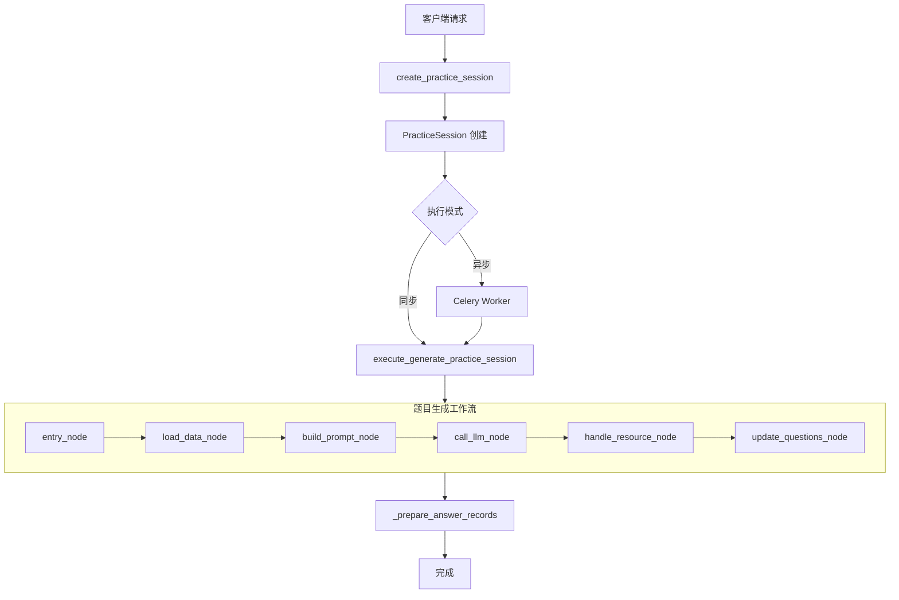
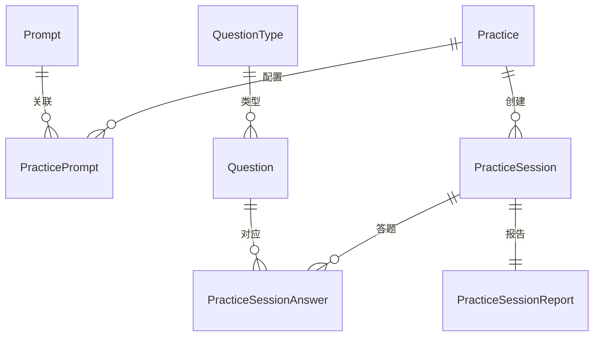

# 练习生成系统重构优化方案

## 一、现有架构分析

### 1.1 系统架构



### 1.2 核心模块

| 模块             | 文件                                  | 职责                        |
| ---------------- | ------------------------------------- | --------------------------- |
| 练习配置         | `admin/data/practice.py`              | 系统练习初始化数据          |
| 会话管理         | `shared/practice/generate.py`         | 创建会话、触发生成          |
| LangGraph 工作流 | `shared/generation/question/graph.py` | 题目生成流程编排            |
| 练习服务         | `services/daily_practice.py` 等       | 各类型练习的 Prompt 构建    |
| 题目处理         | `services/question.py`                | LLM 返回处理、Question 创建 |

### 1.3 数据模型关系



---

## 二、问题识别

### 2.1 架构问题

| 问题               | 位置                   | 影响                      |
| ------------------ | ---------------------- | ------------------------- |
| 🔴 硬编码路由      | `PRACTICE_SERVICES`    | 新增练习类型需改代码      |
| 🔴 服务端散落      | 3 个练习服务文件       | 重复代码、维护困难        |
| 🟡 Prompt 加载低效 | `build_prompt`         | 每次生成都查询数据库      |
| 🟡 资源生成串行    | `handle_resource_node` | 图片/音频逐个生成阻塞流程 |

### 2.2 代码问题

| 问题             | 位置                                | 说明                      |
| ---------------- | ----------------------------------- | ------------------------- |
| 学习数据未使用   | `daily_practice.py:69-74`           | 知识点列表全为空          |
| 题型查询返回混乱 | `_get_question_types`               | 返回嵌套 dict，使用不直观 |
| 函数签名不一致   | `handle_llm_questions`              | 参数顺序与调用不符        |
| 异常处理不完整   | `execute_generate_practice_session` | LLM 失败无回滚            |

### 2.3 可扩展性问题

-   新增练习类型需要：创建服务文件 + 修改路由映射
-   Prompt 模板与练习类型强耦合
-   题型配置未与生成逻辑联动

---

## 三、优化方案

### 3.1 阶段一：架构优化（高优先）

#### 3.1.1 统一练习策略接口

```python
# shared/practice/strategies/base.py
class BasePracticeStrategy(ABC):
    """练习生成策略基类"""

    @abstractmethod
    async def load_context(self, state) -> dict:
        """加载练习上下文数据"""
        pass

    @abstractmethod
    async def build_prompt(self, state) -> dict:
        """构建 Prompt"""
        pass

    @classmethod
    def get_slug(cls) -> str:
        """返回练习标识"""
        raise NotImplementedError
```

#### 3.1.2 策略自动注册

```python
# shared/practice/strategies/__init__.py
STRATEGY_REGISTRY: dict[str, type[BasePracticeStrategy]] = {}

def register_strategy(cls):
    """装饰器：自动注册策略"""
    STRATEGY_REGISTRY[cls.get_slug()] = cls
    return cls

def get_strategy(slug: str) -> BasePracticeStrategy:
    if slug not in STRATEGY_REGISTRY:
        raise ValueError(f"未知练习类型: {slug}")
    return STRATEGY_REGISTRY[slug]()
```

#### 3.1.3 目录结构

```
shared/practice/
├── strategies/
│   ├── __init__.py          # 注册器
│   ├── base.py              # 基类
│   ├── daily.py             # 日常练习策略
│   ├── unit.py              # 单元练习策略
│   └── assess.py            # 综合评估策略
├── services/
│   ├── prompt.py            # Prompt 服务
│   └── question.py          # 题目处理
└── generate.py              # 入口（简化）
```

---

### 3.2 阶段二：性能优化

#### 3.2.1 Prompt 缓存

```python
# shared/practice/services/prompt.py
from functools import lru_cache

@lru_cache(maxsize=100)
async def get_cached_prompt(subject: str, grade: int, practice_slug: str):
    """缓存 Prompt 模板"""
    # 查询 PracticePrompt
    pass
```

#### 3.2.2 资源并行生成

```python
# graph.py - handle_resource_node
import asyncio

async def handle_resource_node(state) -> dict:
    tasks = []
    for q in state["generated_questions"]:
        if q.resource_type == "image":
            tasks.append(generate_image(q))
        elif q.resource_type == "audio":
            tasks.append(generate_audio(q))

    if tasks:
        await asyncio.gather(*tasks)

    return {"generated_questions": state["generated_questions"]}
```

#### 3.2.3 批量数据库操作

```python
# 使用 bulk_insert_mappings 替代 add_all
from sqlalchemy import insert

async def bulk_create_questions(db, questions):
    await db.execute(insert(Question), [q.to_dict() for q in questions])
```

---

### 3.3 阶段三：可维护性优化

#### 3.3.1 配置驱动生成

```python
# PracticePrompt 中新增字段
class PracticePrompt:
    # 已有字段...

    # 生成配置
    generation_config: Mapped[dict] = mapped_column(JSON, comment="""
    {
        "difficulty_distribution": {"easy": 0.3, "medium": 0.5, "hard": 0.2},
        "question_type_weights": {"choice": 0.6, "fill": 0.4},
        "context_requirements": ["textbook", "student_history"]
    }
    """)
```

#### 3.3.2 学习数据集成

```python
# shared/practice/services/student.py
async def get_student_learning_context(db, student_id: str, textbook_id: int):
    """获取学生学习上下文"""
    return {
        "weak_knowledge": await get_weak_knowledges(db, student_id),
        "mastered_knowledge": await get_mastered_knowledges(db, student_id),
        "recent_wrong_questions": await get_recent_wrong(db, student_id),
    }
```

---

### 3.4 阶段四：可观测性优化

#### 3.4.1 生成追踪

```python
# 新增表
class QuestionGenerationLog(BaseModel):
    __tablename__ = "ah_question_generation_log"

    id: Mapped[int] = ...
    session_id: Mapped[int] = ...
    prompt_used: Mapped[str] = mapped_column(Text)
    llm_response: Mapped[str] = mapped_column(Text)
    questions_generated: Mapped[int] = ...
    resource_generation_time: Mapped[int] = ...
    total_time: Mapped[int] = ...
    error: Mapped[str] = mapped_column(Text, nullable=True)
```

#### 3.4.2 指标监控

```python
# 集成 Prometheus 或自定义指标
GENERATION_METRICS = {
    "generation_duration_seconds": Histogram(...),
    "questions_generated_total": Counter(...),
    "generation_errors_total": Counter(...),
}
```

---

## 四、实施路径

| 阶段 | 任务                        | 预估工时 | 优先级 |
| ---- | --------------------------- | -------- | ------ |
| 1    | 统一策略接口 + 自动注册     | 2 天     | 高     |
| 1    | 迁移现有 3 个服务到策略模式 | 1 天     | 高     |
| 2    | Prompt 缓存                 | 0.5 天   | 中     |
| 2    | 资源并行生成                | 0.5 天   | 中     |
| 3    | 配置驱动生成                | 1 天     | 中     |
| 3    | 学习数据集成                | 2 天     | 低     |
| 4    | 生成追踪日志                | 1 天     | 低     |

---

## 五、风险与依赖

> [!WARNING] > **向后兼容**：重构需确保现有 `practice_slug` 路由继续工作

> [!IMPORTANT] > **学习数据集成**：依赖学生答题历史分析模块完善

---

## 六、预期收益

| 指标             | 当前         | 优化后          |
| ---------------- | ------------ | --------------- |
| 新增练习类型耗时 | 2 小时       | 30 分钟         |
| 资源生成耗时     | N×3s（串行） | max(3s)（并行） |
| Prompt 加载      | 每次 DB 查询 | 内存缓存        |
| 代码重复率       | ~40%         | <10%            |
